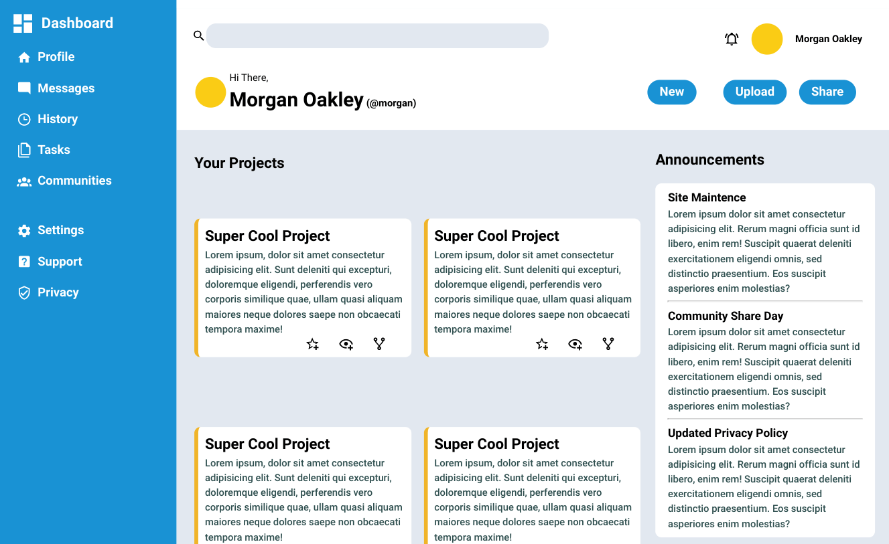
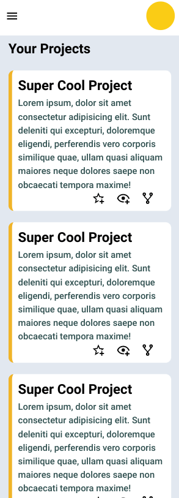

<h1 align="center">Admin Dashboard</h1>

   Solution for a challenge from  <a href="https://www.theodinproject.com/paths/full-stack-javascript/courses/intermediate-html-and-css/lessons/admin-dashboard" target="_blank">theodinproject.com</a>.

## Table of Contents

- [Overview](#overview)
  - [Built With](#built-with)
  - [Thoughts](#thoughts)
- [Features](#features)
- [Improvements](#improvements)
- [Useful Resources](#useful-resources)

## Overview

[Live Link](https://jdegand.github.io/odin-project-admin-dashboard/)

### Built With

- HTML
- CSS
- JS

### Thoughts

I made the page responsive and used the Resize Observer API to make sure the desktop version always has the sidebar displayed.    

Using toggle can cause unintended results but I didn't see any problems in brief testing.  

I didn't make the sidebar overlap the main content on mobile.  Possible without major rework ? 

Sidebar topics could be links with href="#".  

I don't think aside tag applies for either the sidebar, trending and announcements areas.  I have seen people use it for sidebars but I don't feel that it applies since you are allowed multiple navs on a page.  If multiple navs, have to aria-label one nav as primary etc.  

Aside tag doesn't have much use so it can applied in questionable spots just to use it.  

Originally had the js click on the menu to make sure the sidebar was displayed on first load.  This was before I added the resize observer.  Removed that code then the close button didn't work so I moved the close event listener outside the handle function. Originally had it inside the handle function so I wouldn't add a listener to an element that might not even be rendered. 

This project idea led me to research and test out React-Admin.

## Features

The [challenge](https://www.theodinproject.com/paths/full-stack-javascript/courses/intermediate-html-and-css/lessons/admin-dashboard) was to build a full dashboard design that uses CSS Grid for the majority of the layout work.  

## Improvements

- Accessibility
- Semantic HTML improvements
- Improve JS

### Resources

- [Image Color Picker](https://imagecolorpicker.com)
- [Material Design Icons](https://materialdesignicons.com/)
- [Vecta](https://vecta.io/nano) - Compress SVG
- [Blog](https://piccalil.li/blog/a-modern-css-reset/) - CSS Reset
- [Emmet](https://docs.emmet.io/abbreviations/lorem-ipsum/) - lorem command
- [Blog](https://jonsuh.com/hamburgers/) - hamburgers
- [Blog](https://alvarotrigo.com/blog/hamburger-menu-css/) - CSS Hamburger
- [YouTube](https://www.youtube.com/watch?v=l4fLswXHIbU) - Responsive Dashboard
- [Stack Overflow](https://stackoverflow.com/questions/4676388/multiple-nav-tags#:~:text=Yes%2C%20having%20multiple,nav%3E%20using%20aria%2Dlabel%20.&text=You%20can%20read%20more%20about%20using%20Multiple%20Navigation%20Landmarks.) - multiple nav tags
- [Aditus](https://www.aditus.io/button-contrast-checker/)- button contrast checker
- [Stack Overflow](https://stackoverflow.com/questions/22252472/how-to-change-the-color-of-an-svg-element) - color of an svg
- [Stack Overflow](https://stackoverflow.com/questions/3437786/get-the-size-of-the-screen-current-web-page-and-browser-window) - window width
- [Stack Overflow](https://stackoverflow.com/questions/641857/javascript-window-resize-event) - Resize event
- [YouTube](https://www.youtube.com/watch?v=jxcoo5oM_oQ) - Resize Observer API
- [GoMakeThings](https://gomakethings.com/why-you-shouldnt-attach-event-listeners-in-a-for-loop-with-vanilla-javascript/) - event listeners in a loop
- [GoMakeThings](https://gomakethings.com/why-event-delegation-is-a-better-way-to-listen-for-events-in-vanilla-js/) - event delegation
- [Stack Overflow](https://stackoverflow.com/questions/446892/how-to-find-event-listeners-on-a-dom-node-in-javascript-or-in-debugging) - getEventListeners(domElement)
- [Stack Overflow](https://stackoverflow.com/questions/33970943/css-javascript-does-displaynone-remove-any-associated-event-listeners-tem#:~:text=No%2C%20it%20doesn't%20remove,it%20has%20any%20event%20handlers.) - display:none & event listeners
- [Stack Overflow](https://stackoverflow.com/questions/7549561/section-vs-article-html5) - section vs article
- [Web.dev](https://web.dev/control-focus-with-tabindex/) - tabindex
- [WAVE](https://wave.webaim.org/) - WAVE web accessibility checker
